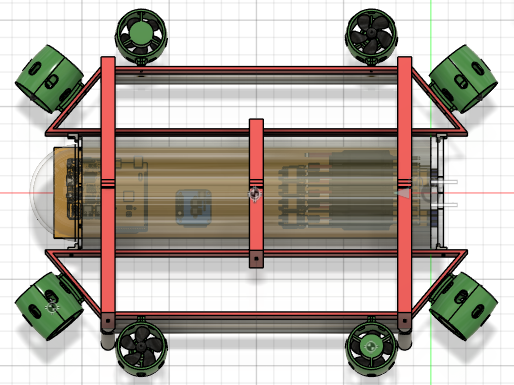
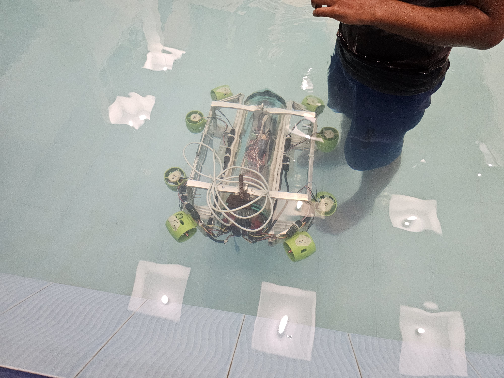
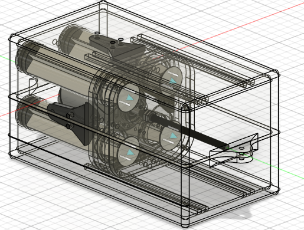
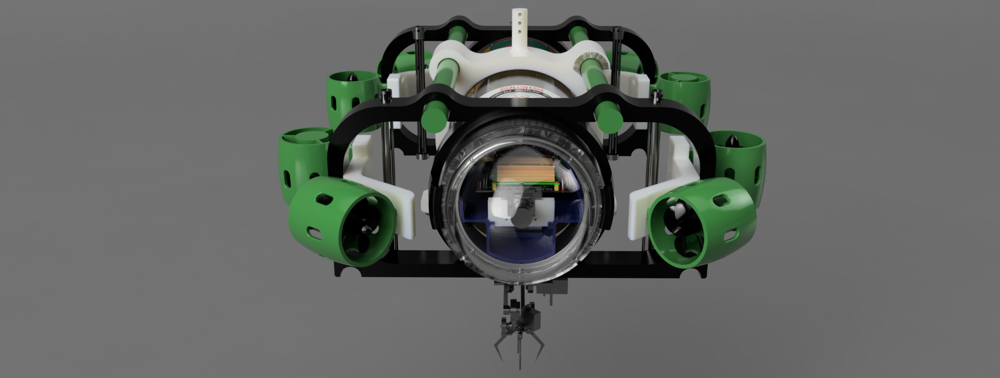
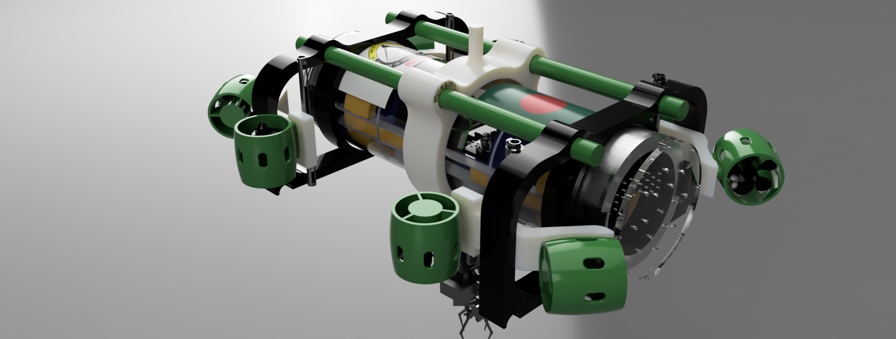
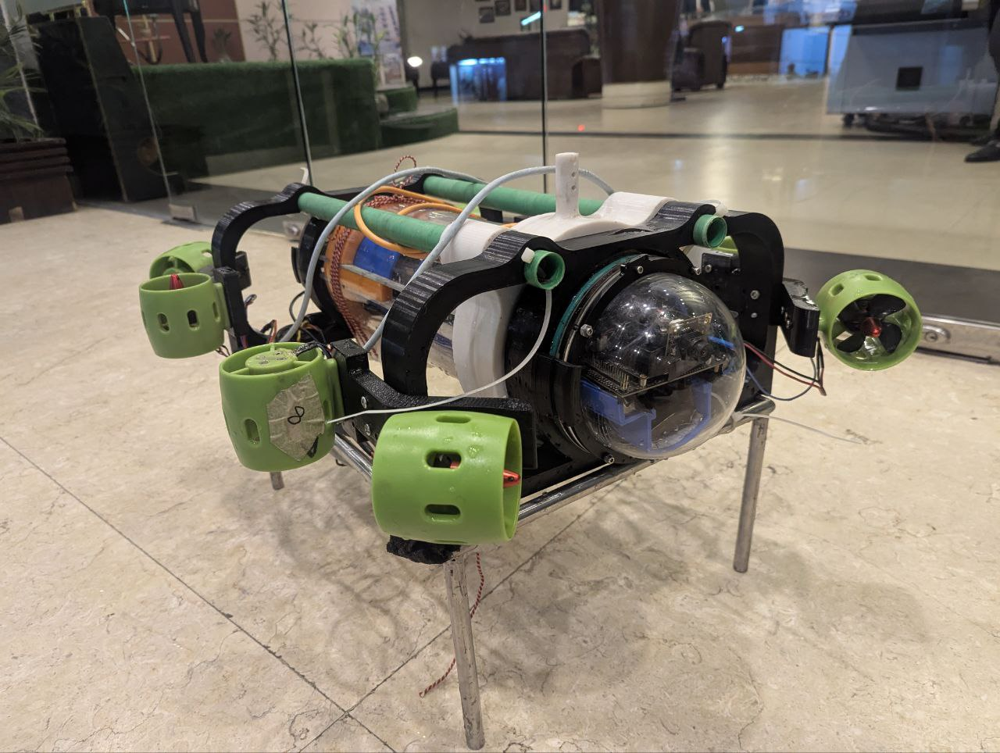

# AUV Mechanical Design - Evolution & Strategy

## Overview
This repository documents the mechanical design considerations and evolution of our Autonomous Underwater Vehicle (AUV) Project - Orca. The primary focus is on achieving optimal buoyancy, stability, and structural integrity while ensuring efficiency in underwater maneuverability.

## **Version 1: Initial Design & Challenges**

### **Design Approach:**
- The **center of mass** was initially intended to be at the geometric center of the bot.
- An **aluminum frame** was used to hold the hull, providing structural support.
- The frame was **hollow**, which contributed to **positive buoyancy**.

### **Manufactured results:**

### **Challenges Faced:**
- The **center of mass** shifted backward, affecting stability.
- The **bot became overly buoyant**, requiring **up to 15 kg** of additional external weight to counteract the buoyancy.
- Excessive weight led to:
  - **High inertia**, making rapid underwater maneuvers difficult.
  - **Increased battery consumption** due to the excessive mass to be controlled.
- The overall design proved inefficient in terms of weight distribution and control underwater.

- The natural bouyancy control mechanism was also made but not utilized for core design issues

## **Version 2: Optimized Design & Improvements**

### **Design Modifications:**
- The frame was **redesigned and 3D printed** with **100% infill density wiht PETG** to achieve a **negatively buoyant** structure.
- External volume was **minimized**, reducing drag and making the design more compact.
- The updated frame, in combination with:
  - The **weight of electronics**
  - **External weight holders**
  ensured the bot achieved **neutral buoyancy at 9 kg**, without requiring additional weights.
- Slots were still included in the design for **optional weight adjustments**, providing flexibility.

### **Centre of Gravity adjustment system:**
- **The x axis is th principal axis for the robot's orientation** and we can adjust centre of gravity distribution along the principal axis for **robust passive adjustment** of it's centre of gravity alighment.
- The design was done in such a way that the center of gravity must lie along the central **x-axis**.
- While **variable adjustment of CoG along x axis** means we can accurately maintain a steady Centre of gravity position at **pitch close to 0 degree**.

- Here is the working version of the same mechanism on our AUV
  
### **Internal Design for Electronics assembly:**
- Hull internal chamber is designed to accomodate the power and logic circuit with esc controllers and micro controllers.
- The 3D prints are done with PETG+ 100% infill density.

  
  

### **Custom 6 DOF manipulator Design:**
- One of the **primary task** was to **pick up a 3cm radius ball** from a busket underwater.
- So we designed a robotic manipulator for it. The **launch pad consist of a camera**. The base (the launching pad) has a **radial targeting system with 2 underwater servo for Azimuth and Elevation adjustment**.
- Another servo to **launch the gripper to the target**. ANother **string based controlled gripper** with a mini servo to grip the target.
- This ensures smooth targeting and launching of the End Effector towards the target calculating underwater proximity using the camera.
- The **bavel gear system allowed opposite rotary mechanism** to launch the EF to the target with accurate mechanism **avoiding the need for and addition servo for two extension rods holding the EF**.
  

  
  

### **Outcome & Benefits:**
- The bot achieved **better buoyancy balance**.
- **Improved energy efficiency**, as less power was required to stabilize and move.
- **Enhanced maneuverability**, allowing smoother and quicker control underwater.
- A structurally **more robust and modular design** suitable for further optimizations.
- **Detailed contents on Version 2 designs**
[Access Folder on Google Drive](https://drive.google.com/drive/folders/1BLFM8DaaLz3syUbcvgXGc0M6o55n4rce?usp=drive_link)

## **Conclusion**
Through iterative mechanical design, we successfully transitioned from an overweight, difficult-to-control AUV to a compact, efficient, and neutrally buoyant design. These insights will guide further refinements in our pursuit of a high-performance underwater vehicle.

---

For further queries, feel free to raise an issue or contribute to the repository!
