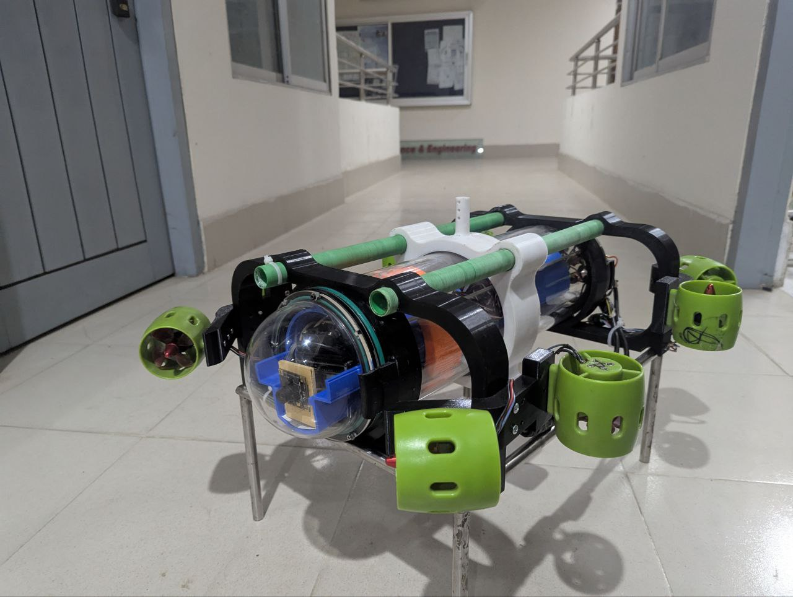
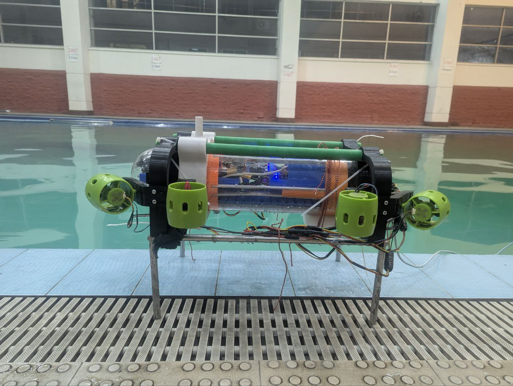

# AUV Mechanical Design - Evolution & Strategy

## Overview
This repository documents the mechanical design considerations and evolution of our Autonomous Underwater Vehicle (AUV) Project - Orca. The primary focus is on achieving optimal buoyancy, stability, and structural integrity while ensuring efficiency in underwater maneuverability.

## **Version 1: Initial Design & Challenges**

### **Design Approach:**
- The **center of mass** was initially intended to be at the geometric center of the bot.
- An **aluminum frame** was used to hold the hull, providing structural support.
- The frame was **hollow**, which contributed to **positive buoyancy**.

### **Manufactured results:**

### **Challenges Faced:**
- The **center of mass** shifted backward, affecting stability.
- The **bot became overly buoyant**, requiring **up to 15 kg** of additional external weight to counteract the buoyancy.
- Excessive weight led to:
  - **High inertia**, making rapid underwater maneuvers difficult.
  - **Increased battery consumption** due to the excessive mass to be controlled.
- The overall design proved inefficient in terms of weight distribution and control underwater.

- The natural bouyancy control mechanism was also made but not utilized for core design issues

-The Buoyancy control mechanism in action 

## **Version 2: Optimized Design & Improvements**

### **Design Modifications:**
- The frame was **redesigned and 3D printed** with **100% infill density wiht PETG** to achieve a **negatively buoyant** structure.
- External volume was **minimized**, reducing drag and making the design more compact.
- The updated frame, in combination with:
  - The **weight of electronics**
  - **External weight holders**
  ensured the bot achieved **neutral buoyancy at 9 kg**, without requiring additional weights.
- Slots were still included in the design for **optional weight adjustments**, providing flexibility.

### **Centre of Gravity adjustment system:**
- **The x axis is th principal axis for the robot's orientation** and we can adjust centre of gravity distribution along the principal axis for **robust passive adjustment** of it's centre of gravity alighment.
- The design was done in such a way that the center of gravity must lie along the central **x-axis**.
- While **variable adjustment of CoG along x axis** means we can accurately maintain a steady Centre of gravity position at **pitch close to 0 degree**.

- Here is the working version of the same mechanism on our AUV

### **Internal Design for Electronics assembly:**
- Hull internal chamber is designed to accomodate the power and logic circuit with esc controllers and micro controllers.
- The 3D prints are done with PETG+ 100% infill density.

  
  

- The internal design section placed with electronics after the manufacturing and printing the Designs

   

### **Custom 6 DOF manipulator Design:**
- One of the **primary task** was to **pick up a 3cm radius ball** from a busket underwater.
- So we designed a robotic manipulator for it. The **launch pad consist of a camera**. The base (the launching pad) has a **radial targeting system with 2 underwater servo for Azimuth and Elevation adjustment**.
- Another servo to **launch the gripper to the target**. ANother **string based controlled gripper** with a mini servo to grip the target.
- This ensures smooth targeting and launching of the End Effector towards the target calculating underwater proximity using the camera.
- The **bavel gear system allowed opposite rotary mechanism** to launch the EF to the target with accurate mechanism **avoiding the need for and addition servo for two extension rods holding the EF**.
  

  
  

### **Summary of Components Used for Mechanical Development:**
- We used the following components listed below in the table:
- 
| Component Name      | Description                  | Quantity | Supplier / Source      |
|---------------------|------------------------------|----------|-----------------------|
| [Main Hull & Caps](https://grabcad.com/library/project-orca-auv-1)        | The Acryllic cylindar caging all electronics| 1        | [Blue Robotics](https://bluerobotics.com/product-category/watertight-enclosures/locking-series/) |
| [BLDC Propellers](https://grabcad.com/library/project-orca-auv-1)         |Thrusters for Actuation| 8        | [RoboticsBD](https://store.roboticsbd.com/underwater-robotics/1372-underwater-thruster-brushless-motor-4-blade-propeller-propulsion-30-200w-pair-robotics-bangladesh.html) |
| Beat LiPo Battery 4S    | Main power Source| 2(parallel)        | [Local online sources](https://radiogearbd.com/) |
| [FrameV1(Holds the propellers with hull)](https://d2t1xqejof9utc.cloudfront.net/screenshots/pics/df02c0b4d97d6d60ab800cae76a2f348/original.png) | Custom printed with Fusion360  | 5 parts   | [Printer](https://robohub.com.bd/printing-products)
| [FrameV2(Holds the propellers with hull)](https://d2t1xqejof9utc.cloudfront.net/screenshots/pics/305221f855414a7adf2119a9c982b4c0/original.png) | Custom printed with Fusion360  | 6 parts   | [Printer](https://robohub.com.bd/printing-products)|
| [FrameV3(Holds the propellers with hull)](https://d2t1xqejof9utc.cloudfront.net/screenshots/pics/5d900b18f20a09c7b10679acbfe8f5c5/original.png) | Custom printed with Fusion360  | 9 parts   | [Printer](https://robohub.com.bd/printing-products)|
| Killswitch Rotary       | Emergency Shutdown | 1     |[Blue Robotics](https://bluerobotics.com/product-category/watertight-enclosures/locking-series/) |
| [Robotic Manipulator Arm(Custom Made)](https://d2t1xqejof9utc.cloudfront.net/screenshots/pics/e86ad652f1174167f072f850d9c034c4/original.png)       | Fetching obstacles underwater(3cubic-cm volume) | 13 parts |[Printer](https://robohub.com.bd/printing-products)|
| Buoyancy Box(custom made)[https://d2t1xqejof9utc.cloudfront.net/screenshots/pics/9e2de9b92106f65e2a5b7596a32450cb/original.png]  | Designed to control dive depth using Buoyancy | 8 parts    | [Printer](https://robohub.com.bd/printing-products) |

### **Outcome & Benefits:**
- The bot achieved **better buoyancy balance**.
- **Improved energy efficiency**, as less power was required to stabilize and move.
- **Enhanced maneuverability**, allowing smoother and quicker control underwater.
- A structurally **more robust and modular design** suitable for further optimizations.
- **Detailed contents on Version 2 designs**
[Access Folder on Google Drive](https://drive.google.com/drive/folders/1BLFM8DaaLz3syUbcvgXGc0M6o55n4rce?usp=drive_link)

### **Contribution to AUV Community:**
-We are **open sourcing our design** parts so that any one may find our design useful and use it for their own projects and research for further advancement of AUV technology.
-Anyone interested might find our design parts in the GrabCAD community [here](https://grabcad.com/library/project-orca-auv-1).

## **Conclusion**
Through iterative mechanical design, we successfully transitioned from an overweight, difficult-to-control AUV to a compact, efficient, and neutrally buoyant design. These insights will guide further refinements in our pursuit of a high-performance underwater vehicle.

---

For further queries, feel free to raise an issue or contribute to the repository!
